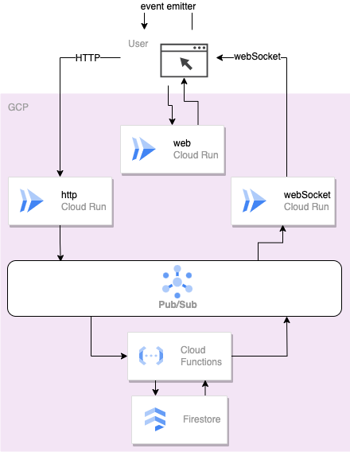

# bi-event-driven-web-connection-PoC

a PoC that use grpc and react event emitter to let user can use event driven pattern both frontend and backend

## Arch

## TODO

1. add event 要回傳 id 才可以實作刪除
2. 前端 state 要存 list ID, 不要用 string list
3. 用 terraform deploy
